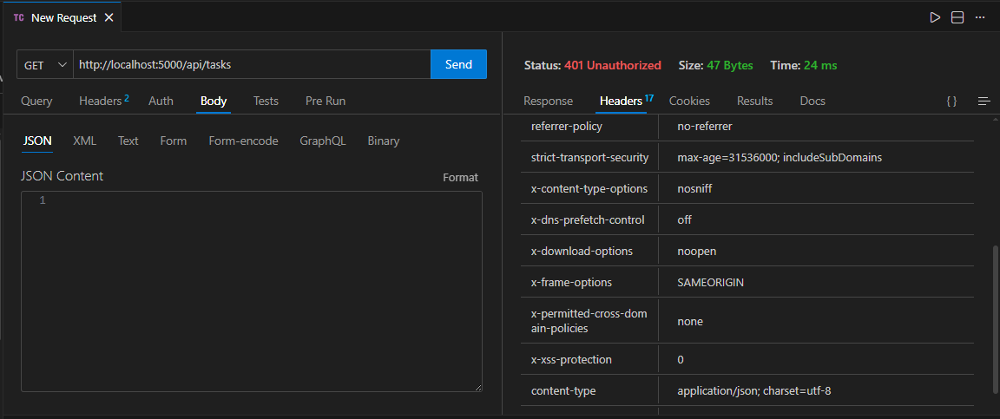
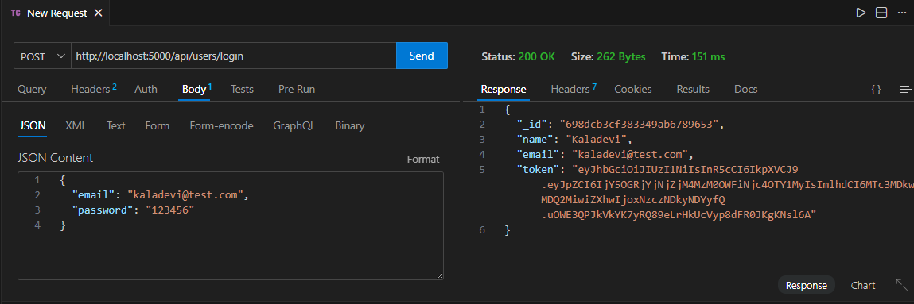
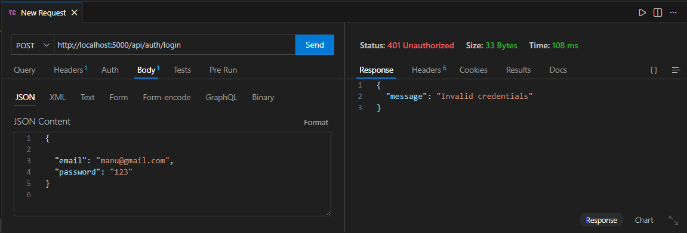
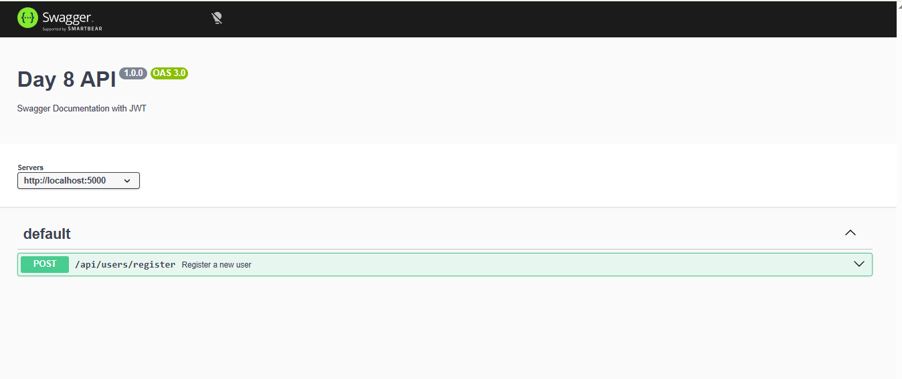
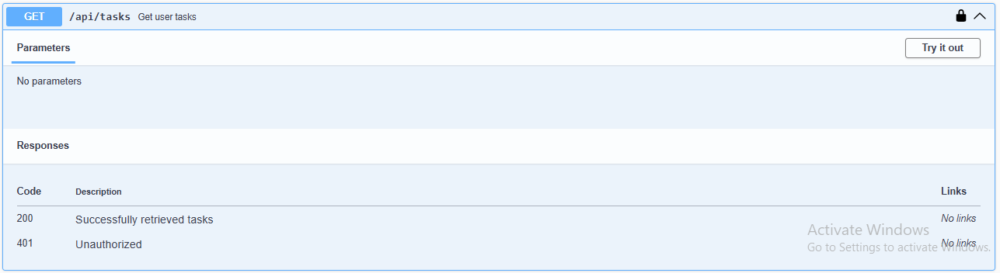
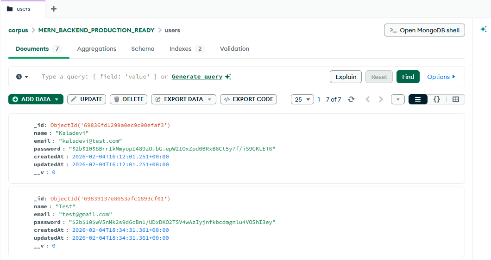
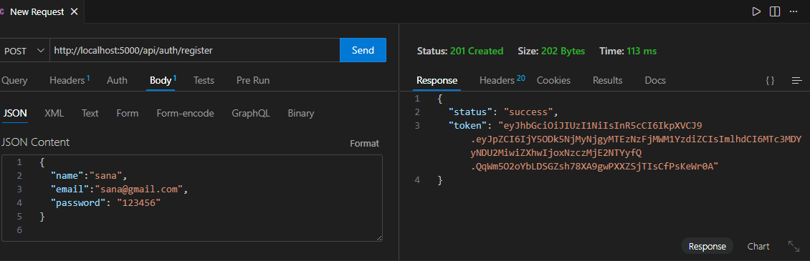

Thunder client test result

1.Register User Success

Register User error

2.Login User success

Login User error

3.Access Protected Route

DAY 2

1. Register with existing email

2. Login with wrong password

3. Hit invalid route

Day-3

Register success

Register failed

Password invalid

login success

login failed

Day 4

1.Register User success

2.Register User failed

3.login success

4.login failed

5.Get resultes success

6.Pagination result success
 1, Limit 5 
 

Page 2, Limit 5

8.Filter by Status
Pending Tasks

9.Filter by Status
completed Tasks

Search Tasks (Title Search)
Search keyword: bug

logs/combined.log Normal API Request

Test 2: Trigger an Error

Day-6

Check Security Headers.Helmet is WORKING

Register User success

Rate Limiting Testing-Login API

success

failed

Day-7

Swagger 

swagger registertion successfull responses

Swagger login successfull responses

server running

mongoDB
